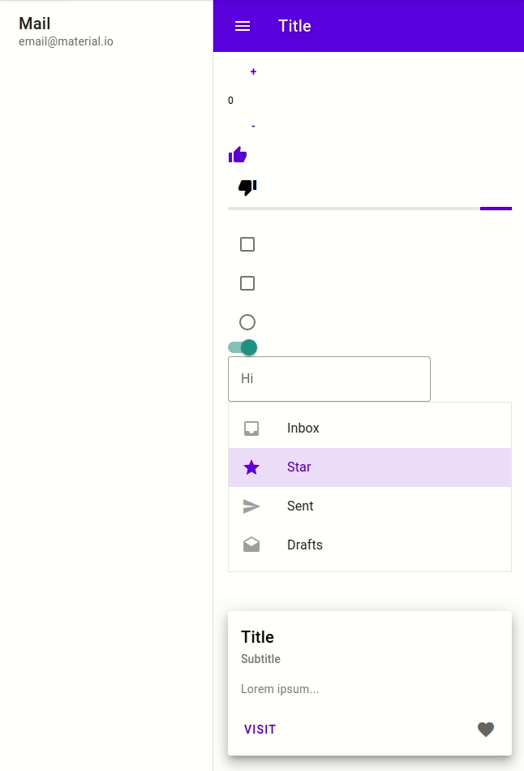

# Matiso - Material Components for Miso
This is a port of https://github.com/aforemny/material-components-web-elm for Miso.

The components are currently defined in ``sample-app-jsaddle/Material``.

The code of the demo website is located ``sample-app-jsaddle/Main.hs``.

## Demo
Visit our demo website [matiso.dev](https://matiso.dev)!

## Documentation
For documentation please visit the elm repository.

## Usage
The release of this package on Hackage is currently planned.

For now please simply use this github repo.

## Contribution
Every contribution is welcome. Whether you want to implement a new component, improve the documentation or help new users!

It is highly recommended to join the Miso community on Slack: https://haskell-miso-slack.herokuapp.com/

In case you want to contribute a component here is a script that makes converting from Elm to Miso a little easier:
https://github.com/developandplay/elm-to-miso
